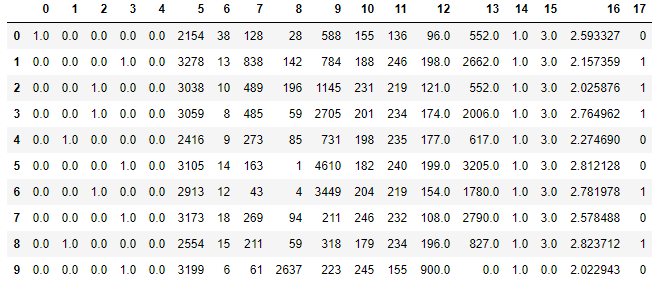
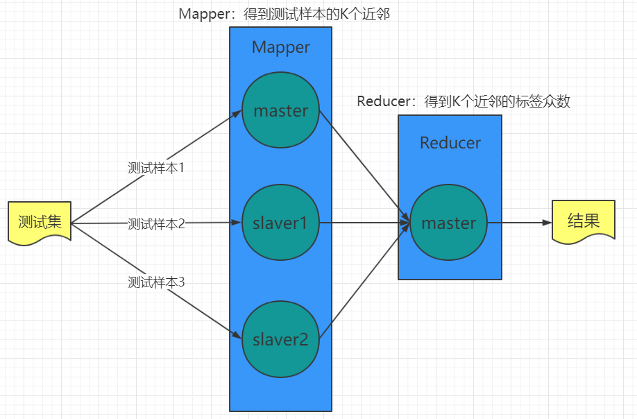

- [KNN-Mapreduce-From-Scratch](#knn-mapreduce-from-scratch)
    - [实验目标](#%E5%AE%9E%E9%AA%8C%E7%9B%AE%E6%A0%87)
    - [环境配置](#%E7%8E%AF%E5%A2%83%E9%85%8D%E7%BD%AE)
    - [使用工具](#%E4%BD%BF%E7%94%A8%E5%B7%A5%E5%85%B7)
    - [使用数据集](#%E4%BD%BF%E7%94%A8%E6%95%B0%E6%8D%AE%E9%9B%86)
    - [实验思路](#%E5%AE%9E%E9%AA%8C%E6%80%9D%E8%B7%AF)
    - [实现代码](#%E5%AE%9E%E7%8E%B0%E4%BB%A3%E7%A0%81)
        - [辅助类实现](#%E8%BE%85%E5%8A%A9%E7%B1%BB%E5%AE%9E%E7%8E%B0)
            - [距离计算类](#%E8%B7%9D%E7%A6%BB%E8%AE%A1%E7%AE%97%E7%B1%BB)
            - [样本实例类](#%E6%A0%B7%E6%9C%AC%E5%AE%9E%E4%BE%8B%E7%B1%BB)
        - [Mapper实现](#mapper%E5%AE%9E%E7%8E%B0)
        - [Reducer实现](#reducer%E5%AE%9E%E7%8E%B0)
        - [KNN_MapReduce实现](#knnmapreduce%E5%AE%9E%E7%8E%B0)
    - [实验过程](#%E5%AE%9E%E9%AA%8C%E8%BF%87%E7%A8%8B)
        - [启动服务](#%E5%90%AF%E5%8A%A8%E6%9C%8D%E5%8A%A1)
        - [导入数据集到HDFS上](#%E5%AF%BC%E5%85%A5%E6%95%B0%E6%8D%AE%E9%9B%86%E5%88%B0hdfs%E4%B8%8A)
        - [运行mapreduce代码](#%E8%BF%90%E8%A1%8Cmapreduce%E4%BB%A3%E7%A0%81)
    - [实验结果及分析](#%E5%AE%9E%E9%AA%8C%E7%BB%93%E6%9E%9C%E5%8F%8A%E5%88%86%E6%9E%90)
    - [附录](#%E9%99%84%E5%BD%95)
        - [xshell上的文件导入导出](#xshell%E4%B8%8A%E7%9A%84%E6%96%87%E4%BB%B6%E5%AF%BC%E5%85%A5%E5%AF%BC%E5%87%BA)
        - [可能出现的问题](#%E5%8F%AF%E8%83%BD%E5%87%BA%E7%8E%B0%E7%9A%84%E9%97%AE%E9%A2%98)

# KNN-Mapreduce-From-Scratch

## 实验目标

使用Mapreduce实现KNN。

## 环境配置

主机配置

|内存大小|处理器类型|处理器个数|操作系统|
|:-:|:-:|:-:|:-:|:-:|
|8GB|Intel(R) Core(TM) i5-5200U CPU @ 2.20GHZ|4|windows 10 专业版|

虚拟机配置

|虚拟机结点代号|内存大小|处理器个数|磁盘大小|操作系统|IP地址|
|:-:|:-:|:-:|:-:|:-:|:-:|
|master|2GB|1|20GB|ubuntu 14.04.4 LTS|192.168.142.128|
|slave1|1GB|1|20GB|ubuntu 14.04.4 LTS|192.168.142.129|
|slave2|1GB|1|20GB|ubuntu 14.04.4 LTS|192.168.142.130|

## 使用工具

- VMware Workstation Pro 14
    - 用于装载和启动虚拟机
- Xshell 5
    - 用于连接和访问虚拟机，实验过程中均在该平台上运行命令

## 使用数据集

本实验使用如下数据分布的训练集和测试集进行算法的测试。



该数据集具有如下特点：

- 数据集中每行数据前17列是以逗号划分的特征列，最后一列为取值为0或者1的标签列；
- 数据集特征可分为如下两类：
    - 离散特征：第0-4列和第14列的取值只为0和1，第15列的取值只为0或者3
    - 连续特征：除了离散特征外的所有其他列均为连续特征列。


其中，训练集共有33600行数据，测试集则有14400行数据。

训练集中，0标签数据占比51.3%，1标签数据占比48.7%，总体差别比例不大。

在本实验中将使用**F1和准确率**来评价算法的表现。

## 实验思路

首先，mapreduce可应用于KNN的前提是：KNN算法中的步骤可拆分为不要求顺序执行的多个部分。理解了KNN算法原理后便可想到：多个测试样本求K近邻的过程是不要求顺序执行的，即该过程是可以并行处理的。因此，便可这样设计mapreduce的过程：

- Mapper:输入一个测试样本，得到该测试样本的K个近邻；
- Reducer:输入一个测试样本以及它的K个近邻，得到这K个近邻的标签的众数作为预测标签。

原理示意图如下，由于本实验共有3台虚拟机，故设计3个Mapper结点和一个Reducer结点来完成任务。



## 实现代码

### 辅助类实现

#### 距离计算类

由于KNN求K近邻需要计算两个样本直接的距离，这里便实现该类来完成该部分功能。

```java
class Distance {
    /*计算样本a与样本b之间的欧式距离*/
    public static double calcEuclideanDistance(double[] a, double[] b) {
        double sum = 0.0;
        for (int i = 0; i < a.length; i++) {
            sum += Math.pow(a[i] - b[i], 2);
        }
        return Math.sqrt(sum);
    }
}
```

这里为了测试方便，只实现了欧式距离的计算方式。

#### 样本实例类

由于在算法处理过程中需要将数据集的每行数据，也即是每个样本，依靠分隔符将其在各个特征上的取值和标签取值提取出来。因此便实现该类来完成数据的转换工作。

```java
class Instance {
    /*根据每一行数据划分数据的特征、标签*/
    private double[] attributeSet;//样例属性
    private double label;         //样例标签

    public Instance(String data_line) {
        //用逗号分隔数据
        String[] data_input = data_line.split(",");		 
        //前length-1项为属性
        attributeSet = new double[data_input.length - 1];
        for (int i = 0; i < attributeSet.length; i++) {
            attributeSet[i] = Double.parseDouble(data_input[i]);
        }
        //第length项为标签
        label = Double.parseDouble(data_input[data_input.length - 1]);
    }

    public double[] getAttributeSet() {
        return attributeSet;
    }

    public double getlabel() {
        return label;
    }
}
```

### Mapper实现

由于在Mapper中要计算一个测试样本和整个训练集所有样本的距离，并找出与其距离最近的K个近邻的标签。因此，首先需要实现如下两个函数：
- setup函数，该函数在所有Mapper结点开始工作之前被调用，因此便可在该函数中加载整个训练集到内存上；
- map函数：其是Mapper的核心函数，将计算测试样本与训练集所有样本的距离，并找出与其距离最近的K个近邻的标签。

```java
 public static class KNN_Mapper extends Mapper<LongWritable, Text, Text, Text> {
    public ArrayList<Instance> trainSet = new ArrayList<Instance>();
    /*******在这里修改 K 值*******/
    public int K = 1;
    /*******在这里修改 K 值*******/
    protected void setup(Context context) throws IOException, InterruptedException {
        //读取训练集
        FileSystem fileSystem = null;
        try {
            fileSystem = FileSystem.get(new URI("hdfs://192.168.142.128:9000/"), new Configuration());
        } catch (Exception e) {
        }
        FSDataInputStream trainSet_input = fileSystem.open(new Path("hdfs://192.168.142.128:9000/knn_train/train.txt"));
        BufferedReader trainSet_data = new BufferedReader(new InputStreamReader(trainSet_input)); 

        //逐行划分训练集中特征以及标签
        String str = trainSet_data.readLine();
        while (str != null) {
            trainSet.add(new Instance(str));
            str = trainSet_data.readLine();
        }
    }

    protected void map(LongWritable k1, Text v1, Context context) throws IOException, InterruptedException {
        
        ArrayList<Double> distance = new ArrayList<Double>(K);
        ArrayList<String> trainlabel = new ArrayList<String>(K);
        
        //初始化前 K 小距离和标签值
        for (int i = 0; i < K; i++)
        {
            distance.add(Double.MAX_VALUE);
            trainlabel.add("NAN");
        }
        
        //读取一个test样本
        Instance testInstance = new Instance(v1.toString());
        //计算test样本和各个train样本距离
        for (int i = 0; i < trainSet.size(); i++) {
            double dis = Distance.calcEuclideanDistance(trainSet.get(i).getAttributeSet(), testInstance.getAttributeSet());

            for (int j = 0; j < K; j++)//若距离比元素值小，则覆盖
            {
                if (dis < (Double) distance.get(j)) {
                    distance.set(j, dis);
                    trainlabel.set(j, trainSet.get(i).getlabel() + "");
                    break;
                }
            }
        }
        
        //mapper过程输出: 以测试集特征为 key 值，以 K 个近邻的标签值列表为 value 值
        for (int i = 0; i < K; i++)
        {
            context.write(new Text(v1.toString()), new Text(trainlabel.get(i) + ""));
        }
    }
}

```

### Reducer实现

Reducer的任务就是根据输入的测试样本以及它的K个近邻，使用多数投票的方式，以这K个近邻的标签的众数作为预测标签。

```java
public static class KNN_Reducer extends Reducer<Text, Text, Text, NullWritable> {
    
    protected void reduce(Text k2, Iterable<Text> v2s, Context context) throws IOException, InterruptedException {
        
        //提取输入的标签值
        ArrayList<String> KNeighborsLabel = new ArrayList<String>();
        for (Text v2 : v2s)
        {
            KNeighborsLabel.add(v2.toString());
        }
        
        //统计 K 近邻的标签
        String predictlabel = MajorityVoting(KNeighborsLabel);
        
        //reducer过程输出： 以测试集特征以及预测标为 key 值，以 空值 为 value 值
        String preresult = k2.toString() + "," + predictlabel;
        context.write(new Text(preresult), NullWritable.get());
    }

    public String MajorityVoting(ArrayList KNeighbors) {
        /*多数投票函数实现*/
        HashMap<String, Double> freqCounter = new HashMap<String, Double>();
        
        //遍历所有输入标签，统计出现次数
        for (int i = 0; i < KNeighbors.size(); i++)
        {
            if (freqCounter.containsKey(KNeighbors.get(i))) {
                double frequence = freqCounter.get(KNeighbors.get(i)) + 1;
                freqCounter.remove(KNeighbors.get(i));
                freqCounter.put((String) KNeighbors.get(i), frequence);
            } else {
                freqCounter.put((String) KNeighbors.get(i), new Double(1));
            }
        }
        
        //多数投票得到最终预测标签
        Iterator it = freqCounter.keySet().iterator();
        double maxi = Double.MIN_VALUE;
        String final_predict = null;
        while (it.hasNext())//取出现最多的标签
        {
            String key = (String) it.next();
            Double labelnum = freqCounter.get(key);
            if (labelnum > maxi) {
                maxi = labelnum;
                final_predict = key;
            }
        }
        return final_predict;
    }
}
```

### KNN_MapReduce实现

实现了Mapper和Reducer后，便要在KNN_MapReduce类中main函数进行mapreduce的设置，这样hadoop才可以根据我们配置的信息按照我们想要的方式进行算法的运行。

```java
public class KNN_MapReduce {
	/*KNN mapreduce实现*/

    public static void main(String[] args) throws Exception {
        Configuration conf = new Configuration();
        String[] otherArgs = new GenericOptionsParser(conf, args).getRemainingArgs();
        if (otherArgs.length != 3) {
            System.err.println("Usage: KNN_MapReduce <trainSet_path> <testSet_path> <output_path>");
            System.exit(2);
        }
		
        //若存在output文件夹，则先删除output文件夹
		FileSystem fileSystem = FileSystem.get(conf);
        if (fileSystem.exists(new Path(otherArgs[2])))
        {
            fileSystem.delete(new Path(otherArgs[2]), true);
        }
		
        //设置基本信息
        Job job = new Job(conf, "KNN");
        job.setJarByClass(KNN_MapReduce.class);
        job.setInputFormatClass(TextInputFormat.class);

        //设置Mapper
        job.setMapperClass(KNN_Mapper.class);
        job.setMapOutputKeyClass(Text.class);
        job.setMapOutputValueClass(Text.class);

        job.setNumReduceTasks(1);
        job.setPartitionerClass(HashPartitioner.class);

        //设置Reducer
        job.setReducerClass(KNN_Reducer.class);
        job.setOutputKeyClass(Text.class);
        job.setOutputValueClass(NullWritable.class);
        job.setOutputFormatClass(TextOutputFormat.class);

        //设置训练数据的输入路径
        FileInputFormat.addInputPath(job, new Path(otherArgs[1]));
        //设置任预测结果的输出路径
        FileOutputFormat.setOutputPath(job, new Path(otherArgs[2]));
        //等待任务完成后退出程序
        System.exit(job.waitForCompletion(true) ? 0 : 1);
    }
}    
```

## 实验过程

### 启动服务

首先，开启master、slaver1、slaver2这三台虚拟机，使用xshell连接master。

连接成功后，在master上运行如下命令以启动hadoop：

```sh
hadoop@master:~$ /usr/local/hadoop/sbin/start-all.sh
```

运行后输入`jps`，可看到如下输出，可见hadoop服务启动正常。

```sh
hadoop@master:~$ jps
11073 DataNode
10934 NameNode
11431 ResourceManager
11608 Jps
11260 SecondaryNameNode
11566 NodeManager
```

### 导入数据集到HDFS上

接着通过xshell将训练集`train.txt`以及测试集文件`test.txt`导入到master上，并运行如下命令以将两个文件放置在HDFS上。

```sh
hadoop@master:~$ /usr/loca/hadoop/bin/hdfs dfs -put train.txt /knn_train
hadoop@master:~$ /usr/loca/hadoop/bin/hdfs dfs -put test.txt /knn_test
```

### 运行mapreduce代码

接着通过xshell将`KNN_MapReduce.java`导入到master上。

并在主机上创建shell脚本文件`runKNN.sh`，并添加如下代码：

```sh
#!/bin/bash
#编译java类
javac KNN_MapReduce.java
ls
#打包jar包
jar -cvf KNN_MapReduce.jar *.class
rm *.class
rm *.java
#运行 mapreduce
/usr/local/hadoop/bin/hadoop jar KNN_MapReduce.jar KNN_MapReduce /knn_train /knn_test /knn_output
rm *.jar
#导出运行结果文件
/usr/local/hadoop/bin/hdfs dfs -get /knn_output/*
sz part-r-00000
rm part-r-00000
rm _SUCCESS
```

该脚本文件会将相同目录下的`KNN_MapReduce.java`类编译并打包成jar包，最后在hadoop上运行该类代码，得到算法结果后会弹出提示框以将结果文件从虚拟机导入到主机上。

通过xshell将该脚本导入到master上（和`KNN_MapReduce.java`在同一路径下），并运行如下命令使该脚本有权限运行：

```sh
hadoop@master:~$ chmod 777 runKNN.sh
```

最后运行`./runKNN.sh`命令即可运行算法了。

## 实验结果及分析

|K值|F1值|准确率|运行时间|
|:-:|:-:|:-:|:-:|
|1|0.87880|0.88153|49s|
|2|0.81782|0.83986|54s|
|3|0.84977|0.85236|53s|
|4|0.81499|0.83201|57s|
|5|0.83176|0.83375|56s|

可以看到，KNN算法在测试集上的准确率和F1值均在80%以上，其中K=1时算法表现最佳，运行时间基本在50s左右。

## 附录

### xshell上的文件导入导出

- 文件导入：在命令行输入`rz`后会弹出对话框，选择文件后文件会被导入在当前路径下。
- 文件导出：在命令行输入`sz <file name>`后会弹出对话框，选择路径后文件会被导出到对应路径下。

### 可能出现的问题

- 运行mapreduce的脚本时可能会报错，主要有以下两种情况
    - 1.权限不足：需要使用`chmod 777 runKNN.sh`命令为脚本赋予权限；
    - 2.换行符问题：在windows为`CR LF`，而在linux上则是`LF`，因此需要将文件中的`CR LF`转换为`LF`才可正常运行。


